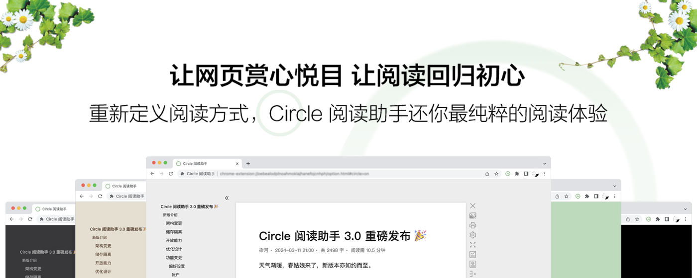

# 什么是 Circle 阅读助手？

**Circle 阅读助手**是一款智能浏览器扩展，专为提高阅读效率而设计。无论您是学生、研究人员、专业人士还是爱好者，**Circle 阅读助手**都能帮助您更好地处理在线文本。她可以把网页中的内容提取出来，重新排版整理成更方便阅读的排版界面。采用自研的识别引擎和排版引擎，识别和排版能力更快更出色更强劲。

## 特色

- **摘要生成**：Circle 阅读助手可以自动提取文章、博客、新闻等文本内容的关键信息，生成简洁的摘要，让您快速了解文章要点。
- **词汇高亮**：Circle 阅读助手可以标记文章中的关键词汇，帮助您更好地理解内容。
- **自定义主题**：选择您喜欢的主题，让阅读界面更加舒适。
- **自研的识别引擎**：借助于自研的识别引擎，Circle 的识别效果更智能，识别速度更快。
- **自研的排版引擎**：借助于自研的排版引擎，Circle 的排版效果更友好，排版速度更快。
- **信纸效果**：像读信件一样的阅读体验。
- **多页解析**：在含有下一页链接的页面上，自动解析下一页的内容并展示在当前页面。
- **分栏阅读**：独创分栏目阅读网页，大屏幕用户的福利，不浪费屏幕每一寸空间。
- **大声朗读**：阅读累了？不如试试听内容吧！解放双手去做其他的。借助于“多页解析”，听小说利器，要啥自行车。
- **预置 5 款炫彩主题**：简约的白色，护眼的绿色、优雅的深灰、深邃的暗黑。Circle 一直是你喜欢的样子。
- **自定义渐变背景或者图片背景**：预置的主题不在你的审美点上？没关系！自定义主题随你泼墨挥毫。
- **自定义各种样式**：仅仅阅读还不能够，网页样式我说了算！字号大一点、字体粗一点、行距高一点，Circle 为你阅读做了每一点。
- **跟随系统切换主题**：仅仅支持自定义主题？不存在的。不同时间切换不同的主题怎么样？。
- **自定义 css**：我要的效果你没有，你这个哈牛逼的丑东西！自定义 css 来助你，懂点 css Circle 就是你的人

## 联系

- **官网** [https://circlereader.com/](https://circlereader.com/)
- **邮箱** [wenguang.fe@gmail.com](mailto:wenguang.fe@gmail.com)

如果您在使用 Circle 阅读助手时遇到问题或有任何建议，请随时联系我们。我们会不断改进扩展，以提供更好的阅读体验。感谢您选择 Circle 阅读助手！祝您阅读愉快！
