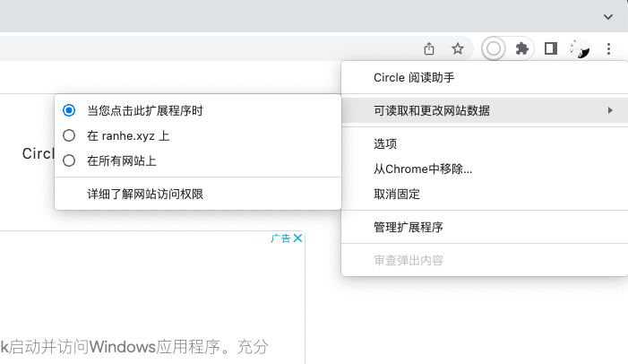

正常情况下，登录账户后会请求网址  **https**://circlereader.com 来同步账户数据。

为了尽可能的减小 Circle 阅读助手的权限，我们对自己的官网也做了限制。所以任何拦截的设置都会导致接口失败。目前已知的存在的可能性如下：

- 所在的环境存在防火墙，开启了白名单，白名单内的网址才可以正常通过，此时请将   circlereader.com 加入白名单。
- 开启了  adguard（扩展或者应用）、adblock 等拦截软件，直接拦截了   circlereader.com 下的请求，请先暂时关闭或者退出相关的软件，帐户验证一次即可。
- ~~火狐浏览器下有一个设置叫 “仅” 允许 “https” 请求，请确保这个选项是关闭的，因为我们的官网暂时还不支持 https。~~
- 设置了“仅特定站点启用” ，该选项会禁用掉你设置的其他网站的所有请求，请先选择**在所有网站上**，验证账户后再次开启。如下图所示**最后一个选项**：

以上原因排查之后基本可以解决大部分问题，如果你发现还有其他可能，欢迎通过页面底部的 “哭泣” 图标来告诉我。
