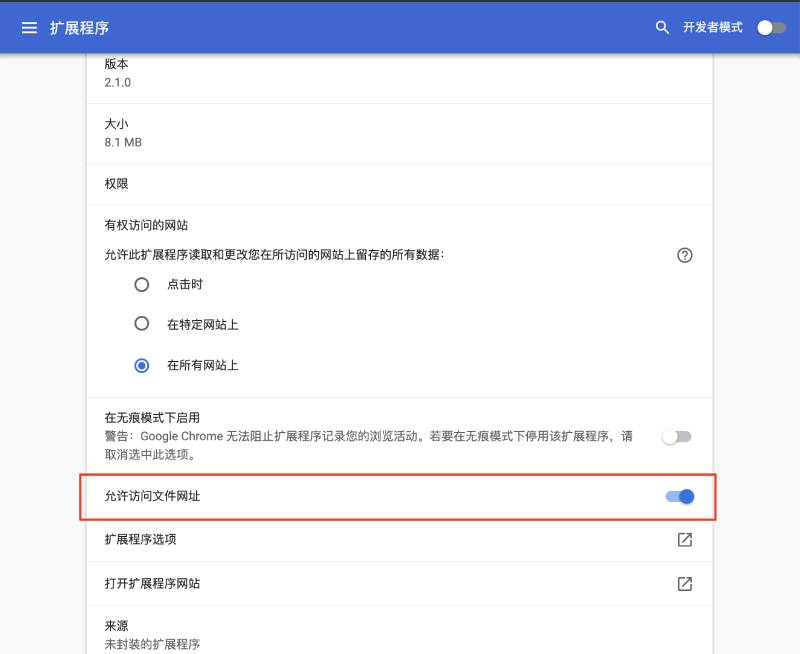

## 之前的功能下线了吗？

部分用户反馈功能越来越复杂，所以新安装的版本会默认开启部分功能。如果你发现部分功能找不到了，可以在偏好设置页面右上角找到“应用市场”图标，点击进去找到你需要的功能后开启对应功能右侧的开关。返回偏好设置就可以看到相关的功能和选项啦～

## 遇到问题如何反馈？

如果您在使用 Circle 阅读助手时遇到问题或有任何建议，你可以通过扩展页面底部的“哭泣”图标联系我们。我们会不断改进扩展，以提供更好的阅读体验。

## 我可以永久免费使用吗？

Circle 阅读助手的大多数功能都是可以永久免费使用的，为了软件能更长久的运行下去，部分高级功能需要升级为高级会员。无论是否付费都可以永久免费使用大多数功能哦～

## 数据保存在哪里？

Circle 阅读助手是一款以本地为主的浏览器扩展，数据全部保存在您的设备中。为了保证数据的安全，我们也有自己云同步（偏好设置帐户页面找到数据同步面板手动同步），目前依赖自己的服务器，后期考虑支持第三方云盘。

## 支持那些浏览器？

当前支持 Firefox、Edge、Chrome 和采用 Chrome 内核的所有浏览器（Safari 开发中）。

## 使用了那些权限？

为了实现功能，Circle 向浏览器申请了如下权限：

- **scripting**： 该权限为了实现正文识别和排版功能。
- **contextMenus**：该权限为了实现右键菜单功能。
- **fontSettings**：该权限允许用户选择系统可用字体。

## 如何阅读本地文件

Circle 阅读助手可以阅读本地文件，支持 txt、html 和 Markdown 等格式文件。你需要授予访问你的本地文件，即在扩展管理详情页面开启 “允许访问文件网址” 。

## 会员相关

### 会员限制设备吗？

不限制。目前未限制设备数量，会员帐户在任何浏览器登录都可以使用会员功能。但不建议分享账号给他人，一旦系统检测到将终身锁定账户。

### 卸载后重新安装需要再次购买吗？

不需要。登录之前的账号即可获取到高级帐户权限。
